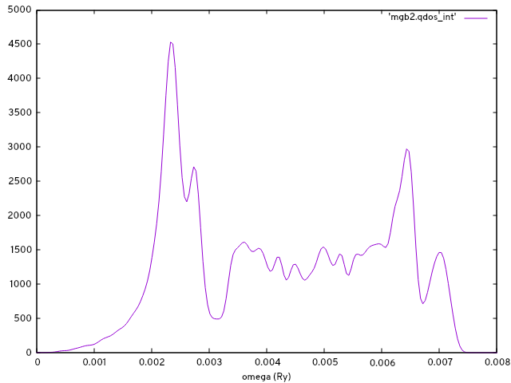

# Electron-phonon interpolation with INTW

### Table of contents
- [Preparation of QE data](#preparation-of-qe-data)
- [INTW-Wannier90 interface](#intw-wannier90-interface)
- [Triangulation of the Fermi surface](#triangulation-of-the-fermi-surface)
- [Electron-phonon by Method I](#electron-phonon-by-method-i)
- [Electron-phonon by Method II](#electron-phonon-by-method-ii)

In this tutorial we showcase INTW electron-phonon interpolation utilities taking hexagonal MgB2 as example and using Quantum ESPRESSO (QE) as DFT code. As part of the workflow, we also make use of the INTW-Wannier90 interface and the Fermi surface (FS) triangulation utility.

Note, the provided `intw.in` contains all the necessary input to perform the calculations described below until the interpolation by Method I. For Method II, the `&elphon` block has to be rewritten.


## Preparation of QE data

Here we do `pw.x` and `ph.x` calculations with the 6.7Max version of QE. In the working directory, we find:

```
$ tree
.
├── B.pz-vbc.UPF
├── create_intw_q_dirs.in
├── intw.in
├── intw_wann.in
├── mgb2_a2F.png
├── mgb2_bands.png
├── mgb2_dos.png
├── mgb2_ph_bands.png
├── mgb2_ph_dos.png
├── mgb2.pw2intw.in
├── mgb2.scf.in
├── mgb2.win
├── Mg.pz-n-vbc.UPF
├── phonons_333
│   └── mgb2.ph.in
└── Tutorial.txt

```

With the pseudo files and the self-consistent (scf) calculation input, we run `pw.x`:

```
$ ${QE_dir}/pw.x < mgb2.scf.in > mgb2.scf.out
```

This electronic calculation uses a $N_k$ = 12x12x12 grid. For the phonons we set a grid $N_q$ = 3x3x3.

`pw2intw.x` reads the phonon data from an individual directory `qq${iq}/` for each q-point index iq. Therefore, `ph.x` must be executed for one q-point at a time. For the `ph.x` input preparation and execution, a script can be used adapted to the needs of the user, or, `create_intw_q_dirs.x` code provided by INTW can be used. In this example `create_intw_q_dirs.in` is provided for this purpose:

```
$ cat create_intw_q_dirs.in
&inputpp
  prefix = "mgb2"
  phdir = "./phonons_333/"
  nq1 = 3, nq2 = 3, nq3 = 3
  reference_file = "mgb2.ph.in"
/
```

Where `reference_file` located inside `phdir` is:

```
$ cat phonons_333/mgb2.ph.in
phonons for MgB2
&inputph
 outdir = './'
 prefix = 'mgb2'
 trans = .true.
 ldisp = .false.
 tr2_ph = 1.0d-16
 fildvscf = 'dvscf'
 fildyn = 'mgb2.dyn'
 verbosity = 'high'
/
```

Note that, because `ldisp` is set to `.false.`, `ph.x` will expect a q-point at the end of the file, which will be added by `create_intw_q_dirs.x` automatically. Now we run:

```
$ ${QE_dir}/create_intw_q_dirs.x < create_intw_q_dirs.in > create_intw_q_dirs.out
```

This will also create the `qlist.txt` file inside `phdir`, which contains a list of the irreducible q-points:

```
cat phonons_333/qlist.txt
  1      0.0000000000      0.0000000000      0.0000000000
  2      0.0000000000      0.0000000000      0.2918855809
  3      0.0000000000      0.3849001795      0.0000000000
  4      0.0000000000      0.3849001795      0.2918855809
  5      0.3333333333      0.5773502692      0.0000000000
  6      0.3333333333      0.5773502692      0.2918855809
```

Then we run the `ph.x` calculation for each q-point:

```
$ cd phonons_333/qq1
$ cp -r ../../mgb2.save .
$ ${QE_dir}/ph.x < mgb2.ph.in > mgb2.ph.out
$ rm -fr mgb2.save
cd ../..
```

And so on until all phonon calculations are completed. Back into the working directory and we are ready to transform the QE data into a format suitable for INTW by running `pw2intw.x`:

```
$ ${QE_dir}/pw2intw.x < mgb2.pw2intw.in > mgb2.pw2intw.out
```

This will create `mgb2.save.intw` directory, where all the data required by INTW is stored:

```
$ tree mgb2.save.intw
mgb2.save.intw
├── 1-KBPP.txt
├── 2-KBPP.txt
├── crystal.dat
├── gvectors.dat
├── iGlist.dat
├── irrq_patterns.dat
├── kpoints.dat
├── mgb2.dvscf_q1
...
├── mgb2.dvscf_q6
├── mgb2.dyn_q1
...
├── mgb2.dyn_q6
├── scf_rhor.dat
├── scf_vr.dat
├── wfc00001.dat
...
└── wfc00133.dat
```

[Back to top :arrow_heading_up:](#electron-phonon-interpolation-with-intw)


## INTW-Wannier90 interface

As usual, we run Wannier90 in preprocessing mode to obtain the `mgb2.nnkp` file with `mgb2.win` as input:

```
$ ${W90_dir}/wannier90.x -pp mgb2
```

The QE calculation produced 8 bands and with the settings

```
$ head mgb2.win

num_bands       =  8
num_wann        =  5
dis_froz_max    =  9.0
...
```

We will disentangle to work with 5 bands after unitary rotation, the lowest in the energy range. In the following `intw.in` input we have selected `use_exclude_bands = 'wannier'`. Here we indicate in the `&input` block the grid and the Fermi energy from mgb2.scf.out, which is needed later:

```
&input
 outdir = './'
 prefix = 'mgb2'
 nk1 = 12
 nk2 = 12
 nk3 = 12
 TR_symmetry = .false.
 use_exclude_bands = 'wannier'
 chemical_potential = 7.3852
/
```

The `&intw2W` block is the input for `intw2W90.x`, which will generate `mgb2.eig`, `mgb2.mmn` and `mgb2.amn` upon symmetry rotation of the wavefunctions and applying the convolution formula described in the paper.

```
&intw2W
 intw2W_fullzone = .false.
 intw2W_method = 'CONVOLUTION'
/
```

We can run `intw2W90.x`, then Wannier90 normally, and finally `w902intw.x`.

```
$ ${INTW_dir}/intw2W90.x < intw.in
$ ${W90_dir}/wannier90.x mgb2
$ ${INTW_dir}/w902intw.x < intw.in
```

This produces the files `mgb2.u_mesh` and `mgb2_hr_intw.dat`, containing the unitary rotations and the Hamiltonian in the real space basis, respectively. With the options in `&DOS` and the `K_PATH` card, we can interpolate the band structure and obtain a density of states at this point:

```
$ ${INTW_dir}/interpolate.x < intw.in
```

```
gnuplot> do for [ qpt in  "0.000000E+00 0.622657E+00 0.982148E+00 0.170113E+01 0.217332E+01 0.279597E+01 0.315546E+01 0.387445E+01" ]{set arrow nohead from qpt,graph 0 to qpt,graph 1 lc "black"}
gnuplot> set xtics ("{/Symbol G}" 0.000000E+00, "M" 0.622657E+00, "K" 0.982148E+00, "{/Symbol G}" 0.170113E+01, "A" 0.217332E+01, "L" 0.279597E+01, "H" 0.315546E+01, "A" 0.387445E+01)
gnuplot> set zeroaxis
gnuplot> set ylabel 'E-E_F (eV)'
gnuplot> p 'mgb2.bnd_int' u 1:2 w l
```


[Back to top :arrow_heading_up:](#electron-phonon-interpolation-with-intw)


## Triangulation of the Fermi surface

The `triFS.x` utility needs the input file blocks `&tri_FS` and `&FS_opt`. At this point, a different energy isosurface can be selected. The `mgb2_hr_intw.dat` file is used internally by triFS.x.

```
$ ${INTW_dir}/triFS.x < intw.in
```

Only some of the files produced by `triFS.x` are needed in the electron-phonon calculation later on:

```
$ ls
...
mgb2.${ish}_FS_tri.off
mgb2.${ish}_FS_tri_v_k.dat
mgb2.${ish}_IBZ_FS_tri.off
mgb2.${ish}_IBZ_FS_tri_v_k.dat
...
```

where `ish`=3,4,5 are band indices of the Fermi sheets identified by `triFS.x`. :heavy_exclamation_mark:NOTE:  bands are labelled according to `set_num_bands`. If we had used `exclude_bands` earlier, the labels would count the bands in the non-excluded set. These `*.off` files contain the triangulated FS in the irreducible Brillouin zone wedge (IBZ) and in the full zone. The `*v_k.dat` files contain the Fermi velocities.


[Back to top :arrow_heading_up:](#electron-phonon-interpolation-with-intw)


## Electron-phonon by Method I

The `&ph` input block describes the phonon grid and dynamical matrix options. In this case, we chose to read the $C(q)$ files, stored in directory `mgb2.save.intw', and to apply an acoustic sum rule:

```
&ph
 nq1 = 3
 nq2 = 3
 nq3 = 3
 nqirr = 6
 qlist = "./phonons_333/qlist.txt"
 read_for_dynmat = 'dynq'
 apply_asr = .true.
/
```

Together with the options in `&DOS_ph` and the card `Q_PATH` in the input, we can calculate the phonon bands by doing:

```
$ ${INTW_dir}/interpolate_phonons.x < intw.in
```

and using Gnuplot with the same `xtics` for the q-path as in the previous band structure figure:

```
...
gnuplot> unset key
gnuplot> set ylabel 'omega (meV)'
gnuplot> set linestyle 1 lc rgb "red" lw 2
gnuplot> p 'mgb2.qbnd_int' u 1:2 w l ls 1, '' u 1:3 w l ls 1, '' u 1:4 w l ls 1,'' u 1:5 w l ls 1,'' u 1:6 w l ls 1,'' u 1:7 w l ls 1,'' u 1:8  w l ls 1,'' u 1:9  w l ls 1,'' u 1:10  w l ls 1
gnuplot> reset
gnuplot> set xlabel 'omega (Ry)'
gnuplot> p 'mgb2.qdos_int' w l
```




The `ep_interp_on_trFS_dV.x` utility calculates the electron-phonon matrix elements for $k+q,k$ pairs on the Fermi surface, including inter-sheet ones, by interpolation of the induced potential (see A. Eiguren and C. Ambrosch-Draxl, Phys. Rev. B 78 (2008) 045124). The interpolation method has to be explicity invoked by the flag `ep_interp_method`. In this example we specify that the sheets labelled 3-5 are to be used with the `ep_interp_bands` option and the range. The k-points will be read in from the `.off` files. :heavy_exclamation_mark:NOTE:  we must provide the commands for running non-self-consistent (nscf) QE calculations and the name of the QE input file of the scf calculation, as INTW will use it as a template to generate the nscf calculations. Here machine options can be introduced, for example, to run `pw.x` in parallel.

```
&elphon
 nscf_code = 'QE'
 ep_interp_method = 'dV_interpolate'
 ep_interp_bands = 'ef_crossing'
 nfs_sheets_initial=3
 nfs_sheets_final=5
 command_pw = "${QE_dir}/pw.x"
 command_pw2intw = "{QE_dir}/pw2intw.x"
 file_pw = 'mgb2.scf.in'
/
```

Upon running

```
$ ${INTW_dir}/ep_interp_on_trFS_dV.x < intw.in
```

the matrix elements, fully resolved into spin blocks if nspin=2, are calculated and printed in file `mgb2_ep_interp.dat` with this format:

```
do js=1,nspin
   do is=1,nspin
      write(unit_ep,fmt="(6i6,100e16.6)") ibp, iksp, ikp, ib, iks, ik,  &
         (aep_mat_el(ikp,ik,js,is,iat), iat=1,3*nat)
   end do
end do
```
where `ibp` and `ib` are sheet indices, `iksp` and `iks` are the k-point indices inside the sheet, `ikp` and `ik` are global k-point counters, and iat runs over phonon modes. Here `iksp` and `iks` are taken from the triangulation on the full zone and the IBZ.

Finally, the `a2F_on_trFS.x` utility reads the `mgb2_ep_interp.dat`, interpolates the dynamical matrix and integrates the Eliashberg function. This utility reads also the triangulation and velocity files:

```
$ ${INTW_dir}/a2F_on_trFS_dV.x < intw.in
```

The first two columns of the output file `mgb2_a2F_interp.dat` contain $\alpha^2F(\omega)$. The other columns are the mode-resolved quantity.

Before proceeding with interpolation Method II, we rename the output to compare results later on.

```
mv imgb2_ep_interp.dat mgb2_ep_interp_dV.dat
mv mgb2_a2F_interp.dat mgb2_a2F_interp_dV.dat
```

[Back to top :arrow_heading_up:](#electron-phonon-interpolation-with-intw)


## Electron-phonon by Method II

To do the same calculation on the FS with Method II we have to calculate the electron-phonon matrix elements on the coarse grid given by $N_k$ and $N_q$. We do this with the `ep_melements.x` utility and updating the `&elphon` block of the `intw.in` file:

```
&elphon
 ep_bands = 'intw'
 ep_mat_file = "ep_mat.dat"
/
```

```
${INTW_dir}/ep_melements.x < intw.in
```

This will store the elements in files `ep_mat.dat_1` to `ep_mat.dat_27` for the coarse q-point grid. Now, we interpolate these elements from the coarse grid onto the triangulated Fermi surface by Wannier interpolation (see F. Giustino et al., Phys. Rev. B 76 (2007) 165108). To do this, we need the `.off` files and a few more lines in the `&elphon` block of the `intw.in`file:

```
&elphon
 ep_bands = 'intw'
 ep_mat_file = "ep_mat.dat"
 ep_interp_method = 'wannier'
 ep_interp_bands = 'ef_crossing'
 nfs_sheets_initial = 3
 nfs_sheets_final = 5
/
```

We run the Wannier interpolation and the Eliashberg function calculation:

```
${INTW_dir}/ep_interp_on_trFS_dV.x < intw.in
${INTW_dir}/a2F_on_trFS_dV.x < intw.in
```

Finally, we rename the results files:

```
mv imgb2_ep_interp.dat mgb2_ep_interp_wann.dat
mv mgb2_a2F_interp.dat mgb2_a2F_interp_wann.dat
```

and we are ready to compare the Eliashberg function from both methods:

```
gnuplot> set ylabel 'a2F(omega)'
gnuplot> set xlabel 'omega(Ry)'
gnuplot> p 'mgb2_a2F_interp_dV.dat' w l,'mgb2_a2F_interp_wann.dat' w l
```


[Back to top :arrow_heading_up:](#electron-phonon-interpolation-with-intw)
